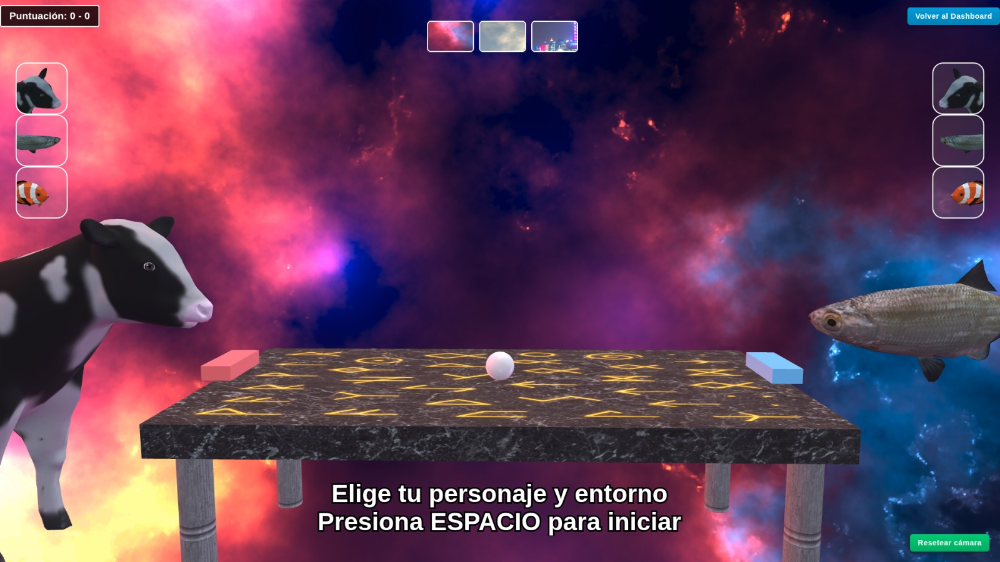
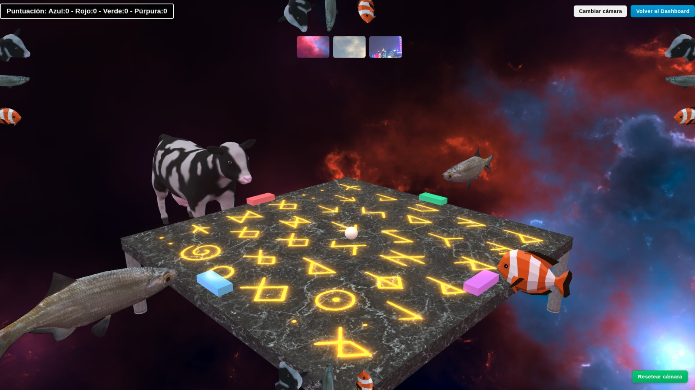
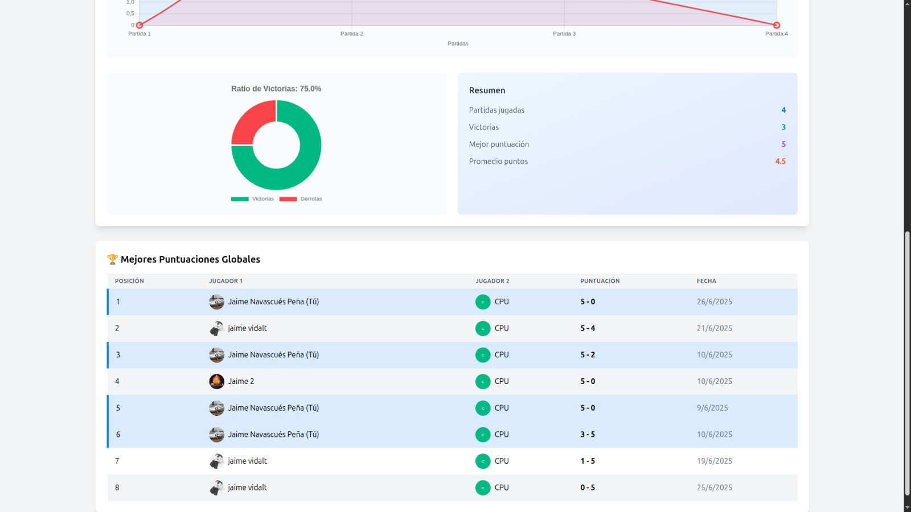
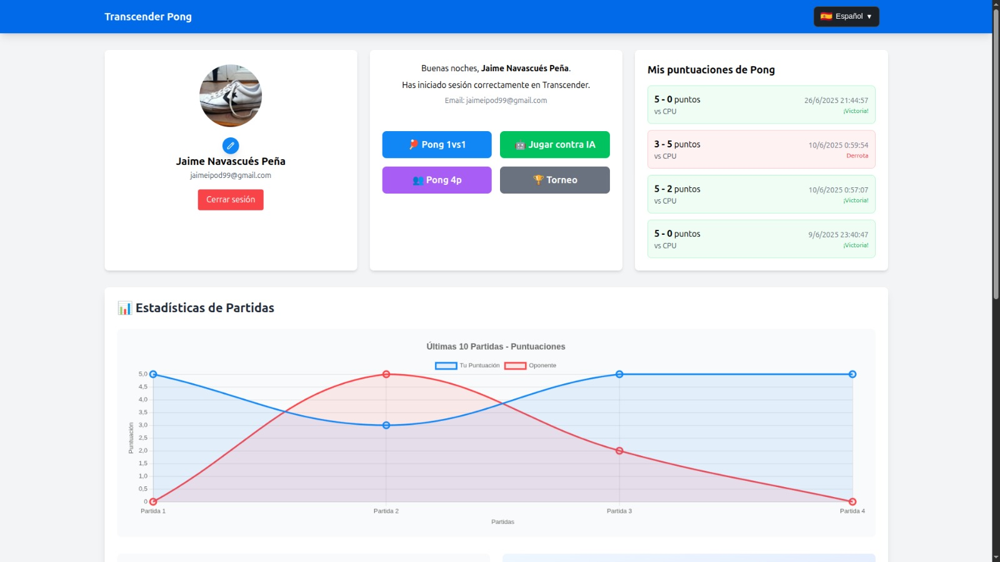

# ft_transcendence


> **Surprise.** 
> 
> This project involves undertaking tasks you have never done before.  
> Remember the beginning of your journey in computer science.  
> Look at you now; it's time to shine!

<table>
  <tr>
    <td></td>
    <td></td>
  </tr>
  <tr>
    <td></td>
    <td></td>
  </tr>
</table>

**ft_transcendence** is the final project of the 42 School Common Core curriculum. It's a comprehensive web application that recreates the classic Pong game with modern web technologies, real-time multiplayer capabilities, and advanced features.

## 🎯 Project Overview

This project is about creating a **single-page application (SPA)** for hosting Pong contests with friends. The emphasis is on learning new technologies and adapting to unfamiliar frameworks, simulating real-world development scenarios.

### 🌟 Core Features

- 🏓 **4 side gamemode** - Play against 3 friends
- 🏆 **Tournament system** - Organize and participate in competitive tournaments  
- 👥 **User management with Google Sign-In** - Registration, authentication, and user profiles
- **2-factor authentication** - Enhanced security with two-factor verification
-�🕹️ **3D Interactive Gameplay** - Communicate with other players
- 📊 **Statistics & leaderboards** - Track your progress and rankings
- 🔒 **Security features** - HTTPS, input validation, and secure authentication

## 🏗️ Architecture

### Mandatory Requirements

- **Frontend**: TypeScript-based single-page application
- **Backend**: Pure PHP (without frameworks) or chosen framework module
- **Database**: Optional, with specific module requirements if used
- **Browser Support**: Latest stable Mozilla Firefox (others supported)
- **Containerization**: Docker with single command deployment
- **Security**: HTTPS, SQL injection/XSS protection, password hashing

### Technology Stack

The project allows for various technology combinations through modules:

- **Backend Options**: PHP (default), Fastify with Node.js
- **Frontend Options**: TypeScript (default), Tailwind CSS
- **Database Options**: SQLite (when database module is selected)
- **Monitoring**: Grafana, Prometheus for system monitoring and metrics
- **Security**: 2-factor authentication for enhanced user security
- **Advanced Features**: Blockchain integration (Avalanche), 3D graphics (Babylon.js)

## 🚀 Quick Start

### Prerequisites

- Docker and Docker Compose
- Modern web browser (Firefox recommended)
- Git

### Installation

1. **Clone the repository**
   ```bash
   git clone https://github.com/jainavas/transcendence.git
   cd transcendence
   ```

2. **Set up environment variables**
   ```bash
   # Copy and configure environment files
   cp .env.example .env
   # Edit .env with your configurations
   ```

3. **Launch with Docker**
   ```bash
   # Build and start all services
   docker-compose up --build
   
   # Or use the provided script (if available)
   ./start.sh
   ```

4. **Access the application**
   - HTTP: `http://localhost:8080`
   - HTTPS: `https://localhost:8443`

### Environment Configuration

Create a `.env` file with the following variables:

```env
# Database Configuration
DB_HOST=postgres
DB_PORT=5432
DB_USER=transcendence
DB_PASSWORD=your_secure_password
DB_NAME=transcendence

# Application Settings
APP_HOST=localhost
APP_PORT=3000
APP_ENV=development

# 42 OAuth (if using remote authentication module)
FORTYTWO_APP_ID=your_42_app_id
FORTYTWO_APP_SECRET=your_42_app_secret
CALLBACK_URL=http://localhost:3000/auth/callback

# JWT Configuration (if using JWT module)
JWT_SECRET=your_jwt_secret
JWT_EXPIRATION=3600

# Additional module configurations...
```

## 🎮 Game Features

### Basic Pong Gameplay
- Two-player local matches using the same keyboard
- Tournament system with multiple players
- Matchmaking system for organizing games
- Consistent game rules and paddle speeds

### Advanced Features (Module-dependent)
- **Remote Players**: Play with friends on different computers
- **Multiplayer**: Support for more than 2 players simultaneously
- **AI Opponent**: Play against artificial intelligence
- **Custom Games**: Additional games beyond Pong
- **3D Graphics**: Enhanced visual experience with Babylon.js

## 🏆 Module System

The project uses a modular approach where you must implement **7 major modules** to achieve 100% completion. Modules are categorized as:

<details>
<summary><strong>Major Modules (10 points each)</strong></summary>

- **Web Framework**: Backend framework implementation ✅
- **User Management**: Advanced authentication and user features
- **Multiplayer for more than 2**: Local or online multiplayer with +2 player ✅
- **Remote Auth**: Google Sign-In auth ✅
- **AI Integration**: Artificial intelligence opponents ✅
- **Infrastructure setup for log management**: Grafana and Prometheus monitoring ✅
- **Microservices**: Backend architecture as microservices
- **Advanced Graphics**: 3D rendering with modern techniques ✅
- **Internationalization**: i18n multi-language support ✅

</details>

<details>
<summary><strong>Minor Modules (5 points each)</strong></summary>

- **Web Framework**: Frontend framework implementation ✅
- **Database Integration**: Data persistence layer ✅
- **Game Customization**: Enhanced gameplay options ✅
- **User Stats and Charts**: User-friendly dashboard with stats of previous matches ✅
- **Monitoring**: System health and performance tracking ✅
- **Accessibility**: Support for disabled users
- **Multi-language**: Internationalization support ✅
- **Multi-browser compatibility**: Multiple browser support ✅

</details>

*Note: Two minor modules count as one major module*

## 🔒 Security Implementation

Security is a core requirement with the following mandatory features:

- ✅ **Password Hashing**: Secure password storage
- ✅ **SQL Injection Protection**: Parameterized queries and input validation
- ✅ **XSS Prevention**: Output encoding and content security policies
- ✅ **HTTPS Enforcement**: Encrypted connections (WSS for WebSockets)
- ✅ **Input Validation**: Both client and server-side validation
- ✅ **Environment Security**: Secrets in `.env` files, excluded from git

## 📁 Project Structure

```
transcendence/
├── backend
│   ├── app
│   ├── Dockerfile
│   └── package.json
├── data
│   └── database.sqlite
├── docker-compose.yml
├── frontend
│   ├── dashboard.html
│   ├── dashboard.ts
│   ├── dist
│   ├── Dockerfile
│   ├── env-config.js
│   ├── env-types.js
│   ├── env-types.ts
│   ├── index.html
│   ├── index.ts
│   ├── main.ts
│   ├── package.json
│   ├── pong
│   ├── pong.html
│   ├── postcss.config.js
│   ├── redirect.html
│   ├── styles.css
│   ├── tailwind.config.js
│   ├── textures
│   ├── tsconfig.json
│   └── webpack.config.js
├── Makefile
├── package.json
├── package-lock.json
└── README.md
```

## 🛠️ Development

### Available Scripts

```bash
# Start the application
make up

# Clean up containers and volumes
make clean

# View logs
docker-compose logs -f [service_name]
```

## 🤝 Contributing

1. Fork the repository
2. Create a feature branch (`git checkout -b feature/amazing-feature`)
3. Commit your changes (`git commit -m 'Add amazing feature'`)
4. Push to the branch (`git push origin feature/amazing-feature`)
5. Open a Pull Request

### Code Style

- Follow TypeScript/JavaScript best practices
- Use consistent indentation (2 spaces)
- Write meaningful commit messages
- Document complex functions and modules

## 📋 Project Requirements Checklist

### Mandatory Part ✅
- [ ] Single-page application with browser navigation
- [ ] Real-time multiplayer Pong game
- [ ] Tournament system with matchmaking
- [ ] User registration and authentication
- [ ] Security implementations (HTTPS, validation, hashing)
- [ ] Docker containerization

### Module Implementation
- [ ] 7 Major modules selected and implemented
- [ ] Module interdependencies resolved
- [ ] All chosen modules fully functional

## 🐛 Troubleshooting

### Common Issues

**Docker container won't start**
```bash
# Check Docker daemon
sudo systemctl status docker

# Check port conflicts
sudo netstat -tulpn | grep :8080

# Reset containers
docker-compose down -v
docker-compose up --build
```

**Database connection issues**
```bash
# Verify database container
docker-compose ps

# Check database logs
docker-compose logs postgres

# Reset database
docker-compose down -v
```

**Frontend not loading**
- Verify HTTPS certificates
- Check browser console for errors
- Ensure all environment variables are set

## 📖 Resources

- [42 School Subject PDF](https://cdn.intra.42.fr/pdf/pdf/117706/en.subject.pdf)
- [Project Modules Documentation](./docs/modules.md)
- [API Reference](./docs/api.md)
- [Docker Setup Guide](./docs/docker.md)

## 📄 License

This project is part of the 42 School curriculum. Please respect the academic integrity policies of your institution.

## 👥 Authors

- [@jainavas](https://github.com/jainavas) - CoDeveloper
- [@mrubal-c](https://github.com/nisp3ro) - CoDeveloper
- [@Flingocho](https://github.com/Flingocho) - CoDeveloper

## 🙏 Acknowledgments

- 42 School for the project specifications
- The amazing Pong game that started it all
- The open-source community for the tools and frameworks

---

**Note**: This project is designed to challenge you with unfamiliar technologies. The goal is not to create a portfolio piece, but to demonstrate your ability to adapt and learn new technologies quickly - a skill essential in your programming career.

*Version 16.1 - Subject specifications may evolve over time*
